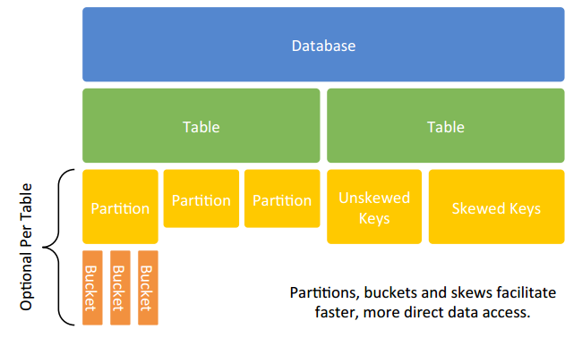
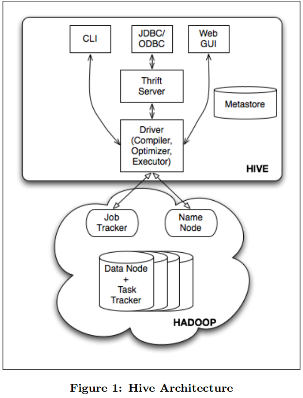
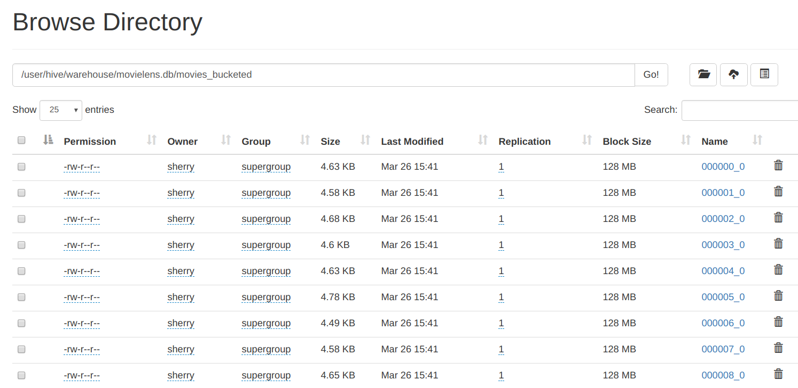
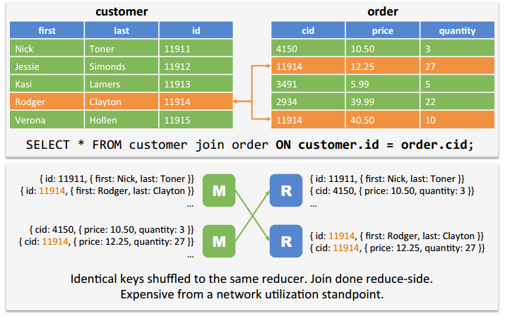
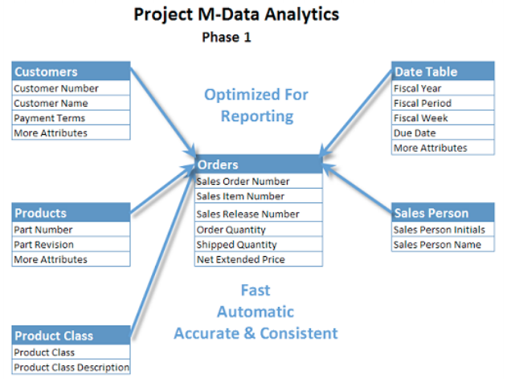
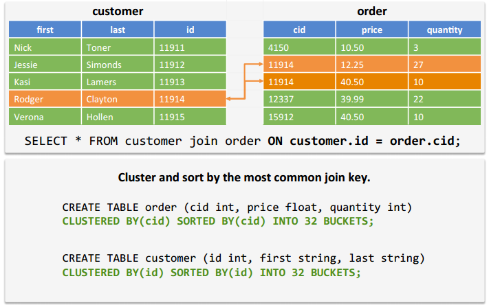

## Hive Presentation

#### 1. Hive简介

Hive是基于Hadoop的，用于读、写和管理大型数据集的数据仓库软件，由Facebook实现并开源。它依赖分布式存储，使用SQL语法进行查询。

**Hive的特点**：

- 通过简单的SQL式的语句来实现**结构化**数据的ETL（extract/transform/load)操作，并生成数据分析结果。
- 可以直接读取Apache HDFS或Apache HBase中的数据
- 通过Apache Tez、Apache Spark或MapReduce执行查询
- Hive的本质是将SQL语句**转换为MapReduce任务**运行，使不熟悉MapReduce的用户方便地利用**HQL**处理和计算存储在HDFS上的数据
- 它专为**OLAP**设计，不是一个关系数据库，也不是被设计用于OLTP，不适合进行实时查询和行级更新（不能增删查改）

**Hadoop生态**：


#### 2. Hive的数据模型



- Tables - 表

  Hive中的表与关系数据库中的表类似，每一个表在HDFS中拥有一个目录。表中存储的数据是序列化的，用户可以将数据与序列格式关联起来。

  - 序列化是对象转化为字节序列的过程，反序列化是字节码恢复为对象的过程
  - Hive支持integer, float, string等原始数据类型，也支持map, list, struct等复杂的数据类型。用户可以通过添加自定义的序列化和反序列化的方法来添加新的数据格式和数据类型。

- Partitions - 分区

  分区决定了数据在目录中的分布。

  - 举例： 

    表T被存储在文件夹`/wh/T`中，在列`ds`和`ctry`上设置了分区，那么`ds`的值为`20190327`且`ctry`值为`China`的数据将会被存储在子目录`/wh/T/ds=20190327/ctry=China` 中。

- Buckets - 桶

  在分区的基础上对数据进行进一步的划分，采用对列值哈希，然后除以桶的个数求余的方式决定该条记录存放在哪个桶当中。

  - 举例：在上例分区的基础上对`userid`列进行分桶，则会产生如下目录：

    `/wh/T/ds=20190327/ctry=China/part-0000` `/wh/T/ds=20190327/ctry=China/part-0001`等

  优点：

  - 对于在相同列上进行分桶的表，可以使用Map端连接，只将保存相同列值的桶进行连接操作即可，大大减少了需要连接的数据量；
  - 使取样更加方便。

#### 3. Hive的查询语言

Hive使用**类SQL**的查询语言`Hive-SQL`，它支持选择、投影、连接、聚合、 联合以及子查询操作。

- Data Definition Language - 数据定义语言

  {create/alter/drop} {table/view/partition}

- Data Manipulation Language - 数据操纵语言

  insert overwrite

- Query Language - 查询语言

  HQL语言支持多表插入(multi-table insert)，即在相同的数据输入上用单条查询语句执行多个查询

- 扩展语言

  可以调用java实现的用户定义列变换函数、用户定义聚合函数，还可以使用其他语言编写的map-reduce脚本

#### 4. Hive架构




- External Interfaces

  包括CLI、WebUI和API（如JDBC、ODBC）

- Thrift Server

  用于从API处执行HQL语句

- Metastore

  用于存储系统目录和表、列、分区的元数据（使用derby或mysql数据库存储，不能使用HDFS因为不支持随机存取）

- Driver（包括Compiler, Optimizer, Executor）

  管理HQL语句的生命周期，追踪执行时间、返回的结果条数等数据

- Compiler

  在Driver收到HQL语句时，将其翻译为一系列的map-reduce任务执行，这些任务组成了一个有向无环图（DAG）

- Execution Engine

  Driver会将每个map-reduce任务按拓扑顺序传递给Execution Engine执行。目前hive使用Hadoop作为执行引擎。

#### 5.  查询的生命周期

```mermaid
graph TD
style id fill:#2ff,fill-opacity:0.1,stroke:#faa,stroke-width:2px
style id3 fill:#2ff,fill-opacity:0.1,stroke:#faa,stroke-width:2px
CLI/WebUI/API --Query--> Compiler
Metastore --metadata--> Compiler
Compiler --parse, type-check, semantic analyze-->id(Logica lPlan)
id(Logical Plan)-->id2[Rule Based Optimizer]
id2[Rule Based Optimizer] --> id3(Optimized Plan)
id3(Optimized Plan) --> id4[Execution Engine]
```

- 优化器的工作原理
  - 将多个使用相同键的连接操作合并成一个连接，以便形成一个map-reduce任务；
  - 为连接、分组和自定义map-reduce运算添加重分区操作，这些重分区操作意味着map操作与reduce操作的分界点；
  - 提前对列进行修剪，将谓词与扫描运算符放在一起以减少数据传送的次数；
  - 如果数据表已经进行了分区，则将不需要的分区修剪掉；
  - 如果遇到取样操作，则将不需要的桶修剪掉。

#### 6. Hive与传统SQL数据库的比较

|                            Hive                             |     关系数据库管理系统     |
| :---------------------------------------------------------: | :------------------------: |
|                         专注于分析                          |    专注于联机查询或分析    |
|                         不支持事务                          |        通常支持事务        |
| 支持按分区添加，不能随机添加单个记录，不支持in-place update |  支持随机的添加和更新操作  |
|                 通过mapreduce实现分布式处理                 |         视产品而定         |
|                   可扩展至成百上千个节点                    | 几乎不能扩展到超过20个节点 |
|                   处理每PB数据的成本很低                    |     What’s a petabyte?     |


#### 7. Demonstration

- 启动hdfs, hive

```console
$ start-dfs.sh
```

```console
Starting namenodes on [localhost]
Starting datanodes
Starting secondary namenodes [sherry-HP-ENVY-Notebook-13-ab0XX]
```

```console
$ hive
```

```
SLF4J: Class path contains multiple SLF4J bindings.
SLF4J: Found binding in [jar:file:/opt/hive/lib/log4j-slf4j-impl-2.10.0.jar!/org/slf4j/impl/StaticLoggerBinder.class]
SLF4J: Found binding in [jar:file:/usr/local/hadoop/share/hadoop/common/lib/slf4j-log4j12-1.7.25.jar!/org/slf4j/impl/StaticLoggerBinder.class]
SLF4J: See http://www.slf4j.org/codes.html#multiple_bindings for an explanation.
SLF4J: Actual binding is of type [org.apache.logging.slf4j.Log4jLoggerFactory]
SLF4J: Class path contains multiple SLF4J bindings.
SLF4J: Found binding in [jar:file:/opt/hive/lib/log4j-slf4j-impl-2.10.0.jar!/org/slf4j/impl/StaticLoggerBinder.class]
SLF4J: Found binding in [jar:file:/usr/local/hadoop/share/hadoop/common/lib/slf4j-log4j12-1.7.25.jar!/org/slf4j/impl/StaticLoggerBinder.class]
SLF4J: See http://www.slf4j.org/codes.html#multiple_bindings for an explanation.
SLF4J: Actual binding is of type [org.apache.logging.slf4j.Log4jLoggerFactory]
Hive Session ID = e95e48ee-b6a7-482b-a68a-45a70597bc9a

Logging initialized using configuration in jar:file:/opt/hive/lib/hive-common-3.1.1.jar!/hive-log4j2.properties Async: true
Hive-on-MR is deprecated in Hive 2 and may not be available in the future versions. Consider using a different execution engine (i.e. spark, tez) or using Hive 1.X releases.
hive> 
```

- 将数据文件复制到hdfs
```console
$ hdfs dfs -mkdir /movielens
$ hdfs dfs -copyFromLocal ~/Documents/dataWarehouse/ml-1m/*.csv /movielens/
$ hdfs dfs -ls /movielens
```

```terminal
Found 3 items
-rw-r--r--   1 sherry supergroup     163542 2019-03-26 09:36 /movielens/movies.csv
-rw-r--r--   1 sherry supergroup   21593504 2019-03-26 09:36 /movielens/ratings.csv
-rw-r--r--   1 sherry supergroup     110208 2019-03-26 09:36 /movielens/users.csv
```

- 创建数据库

```sql
CREATE DATABASES movielens;
USE movielens;
```

- 创建数据表

```sql
-- 创建movies表
CREATE EXTERNAL TABLE movies (MovieID INT, 
	Title varchar(60), 
	Genres varchar(60))
ROW FORMAT DELIMITED FIELDS TERMINATED BY ',' 
LINES TERMINATED BY "\n"
STORED AS TEXTFILE
LOCATION '/movielens/ml-1m/mvs.txt';

-- 创建ratings表
CREATE EXTERNAL TABLE ratings (UserID INT, 
	MovieID INT, 
	Rating INT, 
Timestamp STRING)
ROW FORMAT DELIMITED FIELDS TERMINATED BY ',' 
LINES TERMINATED BY "\n"
STORED AS TEXTFILE
LOCATION '/movielens/ml-1m/rts.txt';

-- 创建users表
CREATE EXTERNAL TABLE users (UserID INT, 
	Gender STRING, 
	Age INT,
	Occupation INT, 
	ZIP INT)
ROW FORMAT DELIMITED FIELDS TERMINATED BY ',' 
LINES TERMINATED BY "\n"
STORED AS TEXTFILE
LOCATION '/movielens/ml-1m/usr.txt';
```


- 导入数据

```sql
LOAD DATA INPATH '/movielens/ml-1m/movies.csv' INTO TABLE movies;
LOAD DATA INPATH '/movielens/ml-1m/ratings.csv' INTO TABLE ratings;
LOAD DATA INPATH '/movielens/ml-1m/users.csv' INTO TABLE users;
```
```sql
SELECT * FROM movies LIMIT 10;
```

```sql
1 Toy Story (1995)  Animation|Children's|Comedy
2 Jumanji (1995)  Adventure|Children's|Fantasy
3 Grumpier Old Men (1995) Comedy|Romance
4 Waiting to Exhale (1995)  Comedy|Drama
5 Father of the Bride Part II (1995)  Comedy
6 Heat (1995) Action|Crime|Thriller
7 Sabrina (1995)  Comedy|Romance
8 Tom and Huck (1995) Adventure|Children's
9 Sudden Death (1995) Action
10  GoldenEye (1995)  Action|Adventure|Thriller
```


- Top 10 viewed

```sql
SELECT movies.MovieID,
	movies.Title,
	COUNT(DISTINCT ratings.UserID) as views
FROM movies JOIN ratings 
	ON (movies.MovieID = ratings.MovieID)
GROUP BY movies.MovieID, movies.Title
ORDER BY views DESC
LIMIT 10;
```


```terminal
Execution completed successfully
MapredLocal task succeeded
Launching Job 1 out of 2
Number of reduce tasks not specified. Estimated from input data size: 1
In order to change the average load for a reducer (in bytes):
set hive.exec.reducers.bytes.per.reducer=<number>
In order to limit the maximum number of reducers:
set hive.exec.reducers.max=<number>
In order to set a constant number of reducers:
set mapreduce.job.reduces=<number>
Job running in-process (local Hadoop)
2019-03-26 11:21:26,647 Stage-2 map = 0%,  reduce = 0%
2019-03-26 11:21:32,812 Stage-2 map = 100%,  reduce = 0%
2019-03-26 11:21:34,828 Stage-2 map = 100%,  reduce = 100%
Ended Job = job_local1582945428_0001
Launching Job 2 out of 2
Number of reduce tasks determined at compile time: 1
In order to change the average load for a reducer (in bytes):
set hive.exec.reducers.bytes.per.reducer=<number>
In order to limit the maximum number of reducers:
set hive.exec.reducers.max=<number>
In order to set a constant number of reducers:
set mapreduce.job.reduces=<number>
Job running in-process (local Hadoop)
2019-03-26 11:21:36,162 Stage-3 map = 100%,  reduce = 100%
Ended Job = job_local901668662_0002
MapReduce Jobs Launched: 
Stage-Stage-2:  HDFS Read: 43211608 HDFS Write: 0 SUCCESS
Stage-Stage-3:  HDFS Read: 43211608 HDFS Write: 0 SUCCESS
Total MapReduce CPU Time Spent: 0 msec
OK
2858	American Beauty (1999)	3428
260	Star Wars: Episode IV - A New Hope (1977)	2991
1196	Star Wars: Episode V - The Empire Strikes Back (1980)	2990
1210	Star Wars: Episode VI - Return of the Jedi (1983)	2883
480	Jurassic Park (1993)	2672
2028	Saving Private Ryan (1998)	2653
589	Terminator 2: Judgment Day (1991)	2649
2571	Matrix	2590
1270	Back to the Future (1985)	2583
593	Silence of the Lambs	2578
Time taken: 20.208 seconds, Fetched: 10 row(s)
```

-  Hive与myql任务执行时间对比

| 项目               | hive        | mysql     |
| ------------------ | ----------- | --------- |
| load-movies        | 0.712s      | **0.09s** |
| load-ratings       | **0.195s**  | 2.95s     |
| load-users         | 0.238s      | **0.09s** |
| query-top10 viewed | **20.208s** | 248.42s   |

```sql
-- Reuslt from mysql
+---------+-------------------------------------------------------+-------+
| MovieID | Title                                                 | views |
+---------+-------------------------------------------------------+-------+
|    2858 | American Beauty (1999)                                |  3428 |
|     260 | Star Wars: Episode IV - A New Hope (1977)             |  2991 |
|    1196 | Star Wars: Episode V - The Empire Strikes Back (1980) |  2990 |
|    1210 | Star Wars: Episode VI - Return of the Jedi (1983)     |  2883 |
|     480 | Jurassic Park (1993)                                  |  2672 |
|    2028 | Saving Private Ryan (1998)                            |  2653 |
|     589 | Terminator 2: Judgment Day (1991)                     |  2649 |
|    2571 | Matrix                                                |  2590 |
|    1270 | Back to the Future (1985)                             |  2583 |
|     593 | Silence of the Lambs                                  |  2578 |
+---------+-------------------------------------------------------+-------+
10 rows in set (4 min 8.42 sec)

--Result from Hive
2858	American Beauty (1999)									3428
260		Star Wars: Episode IV - A New Hope (1977)				2991
1196	Star Wars: Episode V - The Empire Strikes Back (1980)	2990
1210	Star Wars: Episode VI - Return of the Jedi (1983)		2883
480		Jurassic Park (1993)									2672
2028	Saving Private Ryan (1998)								2653
589		Terminator 2: Judgment Day (1991)						2649
2571	Matrix													2590
1270	Back to the Future (1985)								2583
593		Silence of the Lambs									2578
Time taken: 20.208 seconds, Fetched: 10 row(s)
```
- 创建分区表

```sql
--创建新的分区表
CREATE TABLE users1(userid INT, 
Age INT,
Occupation INT,
ZIP INT)
PARTITIONED BY (gender STRING);

--设置动态分区
set hive.exec.dynamic.partition=true;
set hive.exec.dynamic.partition.mode=nonstrict;

--向分区表中插入数据
INSERT INTO TABLE users1
PARTITION(gender)
SELECT userid, age, occupation, zip, gender as gender
FROM users;
```

```console
$ hdfs dfs -ls /user/hive/warehouse/movielens.db/users1

Found 2 items
drwxr-xr-x   - sherry supergroup          0 2019-03-26 15:19 /user/hive/warehouse/movielens.db/users1/gender=F
drwxr-xr-x   - sherry supergroup          0 2019-03-26 15:19 /user/hive/warehouse/movielens.db/users1/gender=M
```


- 创建分桶表

```sql
-- 创建movies_bucketed表
CREATE TABLE movies_bucketed (MovieID INT,
    Title varchar(60),
    Genres varchar(60))
CLUSTERED BY(movieid) INTO 32 BUCKETS;

-- 载入数据
INSERT OVERWRITE TABLE movies_bucketed
SELECT Movieid, Title, Genres from movies;

-- 创建ratings_bucketed表
CREATE TABLE ratings_bucketed(Userid INT,
    Movieid INT,
    Rating INT,
    `Timestamp` STRING)
CLUSTERED BY(movieid) INTO 32 BUCKETS;

-- 载入数据
INSERT OVERWRITE TABLE ratings_bucketed
SELECT Userid, Movieid, Rating, `Timestamp` FROM ratings
```



```sql
set hive.optimize.bucketmapjoin=true;

SELECT movies_bucketed.Movieid, 
	movies_bucketed.Title, 
	COUNT(DISTINCT ratings_bucketed.Userid) AS views
FROM movies_bucketed JOIN ratings_bucketed 
	ON (movies_bucketed.Movieid = ratings_bucketed.Movieid)
GROUP BY movies_bucketed.Movieid, movies_bucketed.Title
ORDER BY views DESC
LIMIT 10;

Time taken: 17.914 seconds, Fetched: 10 row(s)
```

```SQL
SELECT * FROM movies_bucketed TABLESAMPLE(BUCKET 3 OUT OF 32);
```

```terminal
1312	Female Perversions (1996)	Drama
2336	Elizabeth (1998)	Drama
1504	Hollow Reed (1996)	Drama
480		Jurassic Park (1993)	Action|Adventure|Sci-Fi
1633	Ulee's Gold (1997)	Drama
961		Little Lord Fauntleroy (1936)	Drama
865		Small Faces (1995)	Drama
3329	Year My Voice Broke	 The (1987)
866		Bound (1996)	Crime|Drama|Romance|Thriller
3010	Rosetta (1999)	Drama
3811	Breaker Morant (1980)	Drama|War
3076	Irma la Douce (1963)	Comedy
2756	Wanted: Dead or Alive (1987)	Action
2212	Man Who Knew Too Much	 The (1934)
……

Time taken: 0.989 seconds, Fetched: 109 row(s)
```

- Hive中的Join策略

| Join策略类型           | 方法                                                         | 优点                                   | 缺点                                         |
| ---------------------- | ------------------------------------------------------------ | -------------------------------------- | -------------------------------------------- |
| Shuffle Join           | 通过对数据进行重新排序与map reduce实现连接操作               | 不需要考虑数据规模                     | 速度慢，消耗的资源多                         |
| Broadcast Join         | 小的数据表会被加载到所有节点的内存中，mapper会扫描大的数据表并进行连接 | 非常快，只需要对大的数据表进行一次扫描 | 较小的数据表的规模必须足够小，能够被内存容纳 |
| Sort-Merge-Bucket Join | mapper利用连接键的相同同分布进行高效的连接                   | 对于任何规模的数据表都非常快           | 数据必须预先进行排序和分桶                   |







#### 参考文献

[1] Thusoo A , Sarma J S , Jain N , et al. Hive - A Warehousing Solution Over a Map-Reduce Framework[J]. Proceedings of the VLDB Endowment, 2009, 2(2):1626-1629.

[2] Thusoo A , Sarma J S , Jain N , et al. Hive – A Petabyte Scale Data Warehouse Using Hadoop[J]. 2010.

[3] O'Malley O. Hive Tutorial[EB/OL]. https://cwiki.apache.org/confluence/display/Hive/Tutorial, 2019-03-05/2019-03-26.

[4] Cook I. Hive LanguageManual[EB/OL]. https://cwiki.apache.org/confluence/display/Hive/LanguageManual, 2018-10-05/2019-03-26.

[5] Verma A. Getting Started With Hive[EB/OL]. https://towardsdatascience.com/getting-started-with-hive-ad8a93862f1a, 2018-06-12/2019-03-26.

[6] Muise A. 2013 July 23 Toronto Hadoop User Group Hive Tuning[EB/OL]. https://www.slideshare.net/adammuise/2013-jul-23thughivetuningdeepdive, 2013-06-23/2019-03-26.